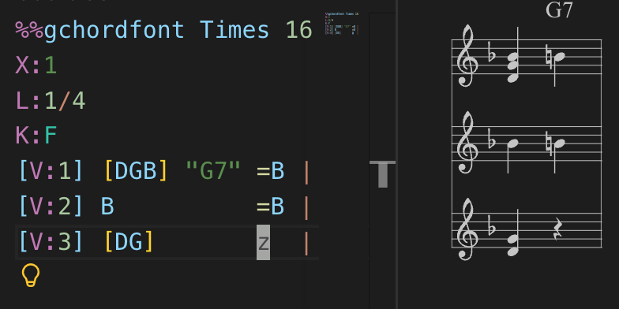

# abcls

A language server, CLI, and editor extensions for [ABC music notation](https://abcnotation.com/wiki/abc:standard:v2.2).



## Install

VS Code: install [abc-ls](https://marketplace.visualstudio.com/items?itemName=AntoineBalaine.abc-ls) from the marketplace.

CLI and LSP server (for Neovim, Helix, Emacs, Kakoune, etc.):

```bash
npm install -g abcls
```

Kakoune users can install the dedicated plugin, which includes `abcls` as a dependency:

```bash
npm install -g abcls-kak
abcls-kak-install
```

## What it does

- Syntax highlighting and semantic tokens
- Diagnostics (errors and warnings)
- Document formatting (barline alignment for multi-voice systems)
- Completions for decorations (`!`), directives (`%%`), and info lines
- Score preview (VS Code) with SVG export
- MIDI input and export
- Selectors and transforms for programmatic score editing (transposition, rhythm manipulation, voice management, enharmonic spelling, etc.)

## CLI usage

```bash
abcls format file.abc        # Format an ABC file
abcls check file.abc         # Check for errors and warnings
abcls render file.abc        # Render to SVG
abcls abc2midi file.abc      # Export to MIDI
abcls midi2abc file.midi     # Convert MIDI to ABC
abcls abcx2abc file.abcx     # Convert ABCx chord sheet to ABC
abcls lsp --stdio            # Start the language server
```

## LSP setup

Point your editor's LSP client at `abcls lsp --stdio`. For example, in Neovim with lspconfig:

```lua
require('lspconfig').abcls.setup {
  cmd = { 'abcls', 'lsp', '--stdio' },
  filetypes = { 'abc' },
}
```

## Documentation

Full documentation is available at [antoinebalaine.github.io/abc_parse](https://antoinebalaine.github.io/abc_parse/).

## Development

```bash
git clone https://github.com/AntoineBalaine/abc_parse.git
cd abc_parse
npm install
npm run build
npm run test
```

The monorepo uses npm workspaces:

```
abc_parse/
  parse/              # Parser library (scanner, parser, formatter, semantic analyzer, interpreter)
  editor/             # CSTree, selectors, and transforms
  cstree/             # Concrete syntax tree data model
  midi/               # MIDI export
  abc-lsp-server/     # Language server
  abc-cli/            # CLI tool
  abc-kak/            # Kakoune plugin
  vscode-extension/   # VS Code extension
  docs-site/          # Documentation website (Astro/Starlight)
  native/             # Optional MuseSampler integration (experimental)
```

Tests use Mocha with fast-check for property-based testing.

## License

GPL-3.0-or-later
