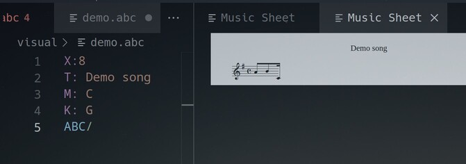

# AbcLsp: Language server for ABC music notation

Language features for [ABC music notation](https://abcnotation.com/)

## Features
- Syntax highlighting.

- Diagnostics warning when the server can't read the score.

- Code formatter.

- `Divide rhythms`, and `Multiply rhythms` commands: select some notes and the commands will divide/multiple their time value by two.
- Single note midi input from you midi keyboard (Chord-input from midi will come at some point)

## Requirements

You might want to use this in conjunction with the [AbcJS](https://github.com/abcjs-music/abcjs-vscode) extension. It provides - amongst others - live preview of the score.

## Known Issues

- Doesn't support lyric sections yet.
- Doesn't support ranges in repeat bars (`|1-2` or `|1,2`).
- Doesn't allow rhythms in grace note groups.
- `Divide rhythms` or `Multiply rhythms` might accidentally duplicate the last character in a text selection.

## Maybe coming to the extension

- Arranging routine capabilities
- Live preview of the score

## Release Notes

AbcLsp isn't yet ready for release!
